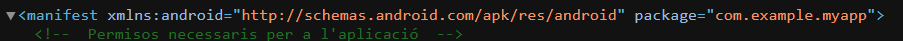

# Identificar caracteristicas de los lenguajes de marcas

## Ejemplos y caracteristicas

### SVG
* **Documentos de Texto Sin Formato:**	Un archivo svg es texto plano. Puedes ver las coordenadas y formas al abrirlo con un editor de texto.
*  **Marcas Insertadas en el Contenido:** Las coordenadas y atributos de forma están dentro de las etiquetas: cx, cy, r 
*  **Componentes Sencillos e Intuitivos:** Los elementos son formas geométricas: rect, circle, line, path
* **Versatilidad y Ámbito Extenso:** Se utiliza para gráficos web (logos, iconos) que deben escalar sin perder calidad.
* **Etiquetas Identificativas del Tipo de Contenido:** La etiqueta "rect" identifica un rectángulo con propiedades específicas (ancho, alto, posición). La etiqueta "fill" identifica el color de relleno.

### ODT
* **Documentos de Texto Sin Formato:** Su contenido principal está en content.xml, un archivo de texto plano dentro del odt 
* **Marcas Insertadas en el Contenido:** Un ejemplo marcas de odt es: text:p **text:style-name="P1"**
* **Componentes Sencillos e Intuitivos:** Estructuras para elementos de documento: text:p, text:span, table:table
* **Versatilidad y Ámbito Extenso:** Estándar abierto para documentos de oficina (compatible con LibreOffice/OpenOffice).
* **Etiquetas Identificativas del Tipo de Contenido:** La etiqueta <style:paragraph-properties> identifica las propiedades de formato del párrafo (alineación, sangría).
### DOCX
* **Documentos de Texto Sin Formato:** Contenido en el archivo document.xml dentro de un ZIP
* **Marcas Insertadas en el Contenido:** El formato se define por nodos hijos dentro de la carrera de texto (w:r): " w:r " " w:b/ " Texto negrita " /w:r " (El tag w:b/ es la marca para negrita)
* **Componentes Sencillos e Intuitivos:** Estructuras jerárquicas con prefijo w:: "w:p" para párrafos y "w:t" para bloques de texto.
* **Versatilidad y Ámbito Extenso:** Estándar dominante de Microsoft Word (ISO/IEC 29500)
* **Etiquetas Identificativas del Tipo de Contenido:** La etiqueta  "w:pPr" identifica las propiedades de formato del párrafo 
### HTML
* **Documentos de Texto Sin Formato:** Un archivo .html es un archivo de texto que puede abrirse y editarse con cualquier editor simple (Notepad, VS Code, etc.)
* **Marcas Insertadas en el Contenido:** Las etiquetas como " b y /b " están insertadas directamente alrededor del texto que quieren modificar: Este es un texto "b" importante "/b".
* **Componentes Sencillos e Intuitivos:** Un conjunto pequeño de etiquetas define la estructura básica: html, head, body, h1, p, img
* **Versatilidad y Ámbito Extenso:** Se utiliza para construir páginas web y aplicaciones en navegadores
* **Etiquetas Identificativas del Tipo de Contenido:** La etiqueta "h1" identifica el texto como un encabezado de nivel 1 (el título principal).

# Espacio de nombres en el archivo androidmanifest

El espacio de nombres se encuentra en la primera linea. Se define en la parte: xmlns:android="http://schemas.android.com/apk/res/android"

